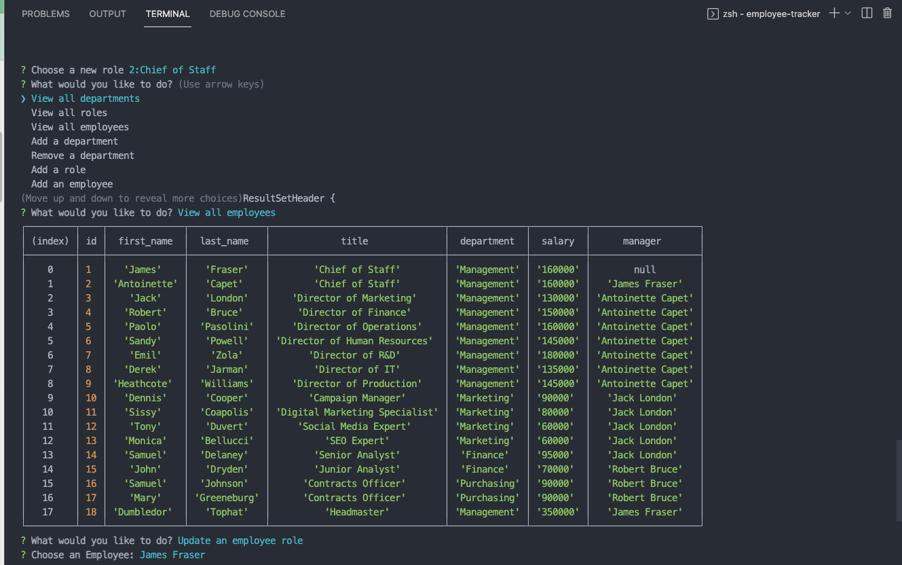

# Employee Tracker CMS

## Description

- A content management system CLI to manage a company's employee database of departments, roles and employees

## Installation

clone the repository, then install the dependencies 

    npm i

## Usage 

    npm start

## License

## Built With

## Questions

Feel free to contact me using the information below!

- GitHub Profile: [@scottrohrig](https://github.com/scottrohrig)

- Email: scott.rohrig@gmail.com

- Project Repository/URL: [github.com/.../employee-tracker](https://github.com/scottrohrig/employee-tracker)

